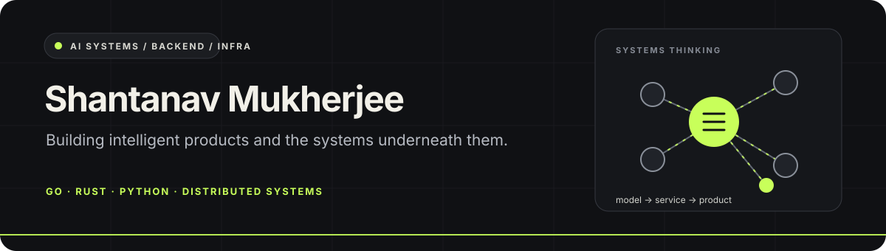
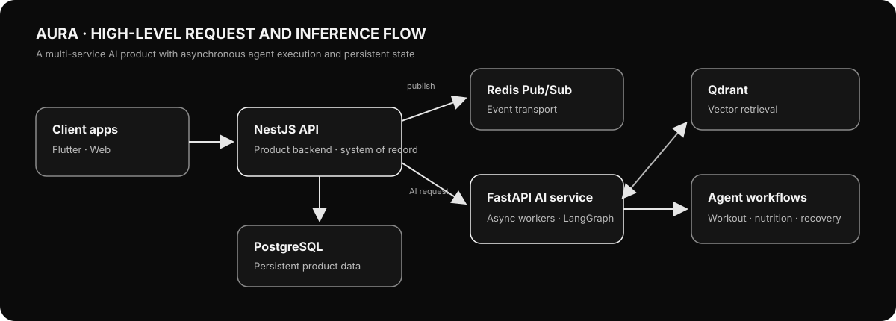

  &nbsp;&nbsp;&nbsp;
  &nbsp;&nbsp;&nbsp;
  &nbsp;&nbsp;&nbsp;
  

<strong>AI Systems · Backend · Infrastructure · Performance</strong> Computer Science, KJ Somaiya School of Engineering · Mumbai, India · Class of 2028

  <a href="#overview">Overview</a> ·
  <a href="#awards">Awards</a> ·
  <a href="#experience">Experience</a> ·
  <a href="#selected-projects">Projects</a> ·
  <a href="#open-source">Open source</a> ·
  <a href="#toolbox">Toolbox</a> ·
  <a href="#current-learning-frontier">Learning frontier</a> ·
  <a href="#contact">Contact</a>

---

## Overview

I’m Shantanav, a computer science student and engineer interested in what happens behind useful AI products: agent workflows, retrieval and evaluation, backend services, data movement, and the runtime that makes software fast and reliable.

I’ve built multi-service AI products, contributed fixes to established open source projects, and worked on a Rust and WebAssembly rendering pipeline that reduced render latency by 40%. I’m deliberately going deeper into core machine learning, operating-system internals, networking, and performance engineering.

<table>
  <tr>
    <td align="center" width="25%"><strong>40%</strong> lower render latency</td>
    <td align="center" width="25%"><strong>7</strong> merged upstream PRs</td>
    <td align="center" width="25%"><strong>4</strong> open contributions</td>
    <td align="center" width="25%"><strong>3</strong> hackathon podium results</td>
  </tr>
</table>

### What I like building

| Area | The work I’m drawn to |
|---|---|
| AI systems | Agent orchestration, retrieval pipelines, asynchronous inference, and evaluation |
| Backend and infrastructure | Services, queues, databases, event flows, deployment, and observability |
| Systems and performance | Rust, WebAssembly, GPU execution, Linux, and understanding costs below the API |
| Product engineering | Turning an idea into a usable tool with a clear interface and dependable behavior |

## Awards

<table>
  <tr>
    <th align="left">Result</th>
    <th align="left">Event</th>
    <th align="left">Project or track</th>
  </tr>
  <tr>
    <td><strong>1st place</strong></td>
    <td>ETH Mumbai 2026</td>
    <td>BitGo DeFi · VCR Protocol</td>
  </tr>
  <tr>
    <td><strong>2nd place</strong></td>
    <td>ETH Mumbai 2026</td>
    <td>Base AIx Onchain · VCR Protocol</td>
  </tr>
  <tr>
    <td><strong>2nd place</strong></td>
    <td>Solana Blitz V7</td>
    <td>Among 300+ international teams</td>
  </tr>
</table>

The two ETH Mumbai results were earned with Team OmShantyOm for VCR Protocol.

## Experience

### Formial Labs · Forward Deployed Engineer
August 2026–present

I build AI workflows that connect conversational interfaces to business operations.

- Implemented WhatsApp agent workflows with SagePilot, including intent routing, structured tool calls, and backend API integrations.
- Integrated Razorpay payment initiation, transaction verification, and status handling into the workflows.
- Worked across the product boundary: translating operational needs into agent behavior and dependable service interactions.

### Craon AI · Full Stack AI Engineer Intern
June–August 2026

I worked on the video pipeline behind browser previews and exported videos.

- Built a shared Rust and WebAssembly rendering core for browser previews and backend exports, reducing preview and export drift.
- Added GPU parallelization to the rendering path, reducing render latency by <strong>40%</strong>.
- Worked across Rust, WebAssembly, GPU execution, and the application surface that uses the renderer.

<strong>How the shared rendering path fits together</strong>

Both preview and export use the same rendering core. The core can use a GPU path when available and a CPU fallback when it is not.

~~~mermaid
flowchart LR
    preview["Browser preview"] --> core["Rust and WebAssembly core"]
    export["Backend export"] --> core
    core --> gpu["GPU path"]
    core --> cpu["CPU fallback"]
~~~

## Selected projects

The projects below show the kinds of systems I want to keep building: AI products with real service boundaries, retrieval and event flows, and software where performance matters.

<strong>VCR Protocol · verifiable spending controls for agent wallets</strong>

[VCR Protocol](https://vcrprotocol.xyz) gives autonomous agents a constrained way to initiate on-chain payments. The core idea is to make an agent’s authority explicit and bounded, so an application can define which actions and amounts are allowed.

- Resolves agent identity with ERC-8004 and ENSIP-25.
- Stores spending policies through Fileverse and IPFS.
- Supports transaction caps, recipient allowlists, and daily limits.
- Connects policy decisions to BitGo MPC and x402 settlement on Base.

**Recognition:** 1st place in the BitGo DeFi track and 2nd place in the Base AIx Onchain track at ETH Mumbai 2026.

~~~mermaid
flowchart LR
    request["Agent payment request"] --> identity["Resolve identity"]
    identity --> policy["Check IPFS policy"]
    policy --> authorize["Authorize through BitGo MPC"]
    authorize --> settle["Settle through x402 on Base"]
~~~

<strong>AURA · multi-agent fitness coach</strong>

[AURA](https://aura-fit.tech) is a fitness product for workout, nutrition, and recovery guidance. Its services separate the mobile experience, product API, and AI workflows so each part can evolve independently.

- Flutter clients connect to a NestJS product API.
- PostgreSQL stores product data; Redis Pub/Sub carries work to the AI service.
- A FastAPI service runs asynchronous LangGraph workflows.
- Qdrant supports vector retrieval for agent context.

Open the architecture diagram

<strong>CurriculumOS · AI learning roadmaps from personal material</strong>

[CurriculumOS](https://github.com/Soundcreates/CurriculumOS) turns a learner’s goal and reference material into a study plan they can follow and measure. Inputs include documents, URLs, and YouTube videos; the product adds progress tracking, resource discovery, and multi-tier quizzes.

- A React and TypeScript client presents roadmaps, tasks, progress, and quiz results.
- A Go API handles authentication, persistence, and progress updates with PostgreSQL.
- QStash dispatches durable generation jobs to a FastAPI retrieval worker.
- The worker processes source material, indexes job-scoped chunks in Chroma, and generates structured roadmaps and quizzes with the OpenAI Responses API.

[Try the live demo](https://curriculum-os-one.vercel.app).

~~~mermaid
flowchart TB
    learner["Learner and source material"] --> client["React client"]
    client --> api["Go API and PostgreSQL"]
    api --> jobs["QStash generation job"]
    jobs --> worker["FastAPI RAG worker"]
    worker --> result["Roadmap, resources, and quizzes"]
~~~

<strong>Craon renderer · shared Rust and WebAssembly video pipeline</strong>

A performance project focused on keeping preview and export behavior aligned while reducing render time.

- Shared rendering logic is compiled to WebAssembly for browser use and used by backend exports.
- GPU execution uses WebGPU and WGSL, with a CPU fallback path.
- Parallelized rendering reduced latency by 40%.

The main engineering lesson was that a fast path is only useful when it remains consistent with the rest of the product. Sharing the core removed a second implementation that could drift.

### More projects

<strong>Applied AI, data, and geospatial projects</strong>

| Project | What it explores |
|---|---|
| [EduAid](https://github.com/Soundcreates/EduAid) | A browser extension and web app for generating revision quizzes from learning material, including a local quantized Qwen3-0.6B question-generation path. |
| [Canopy](https://github.com/Soundcreates/Canopy) | A forest registry that combines Sentinel-2 imagery, Google Earth Engine, and NDVI computation with a web service and smart contracts. |
| [Synapse Ledger](https://github.com/Soundcreates/Synapse) | A prototype data marketplace for AI training that explores dataset provenance, decentralized storage, and on-chain royalty distribution. |

## Open source

I enjoy working in established codebases where a small, well-tested change can improve behavior for many downstream users. The snapshot below reflects the PRs listed here; statuses were checked on 26 September 2026.

<strong>Merged upstream · 7 pull requests</strong>

### Google ADK Go

- [#1257](https://github.com/google/adk-go/pull/1257) Retain usage metadata when later streaming chunks omit it.
- [#1258](https://github.com/google/adk-go/pull/1258) Propagate external cancellation through workflow execution.
- [#1259](https://github.com/google/adk-go/pull/1259) Respect the configured isolation scope for remote agents.

### Other repositories

- [gVisor #14083](https://github.com/google/gvisor/pull/14083) Include a generated changelog in the Debian <code>runsc</code> package.
- [ORAS #2184](https://github.com/oras-project/oras/pull/2184) Publish stable rolling tags for container releases.
- [Hugo #15148](https://github.com/gohugoio/hugo/pull/15148) Resolve the <code>staticcheck</code> executable after <code>go install</code>.
- [Vello #1807](https://github.com/linebender/vello/pull/1807) Document public Cargo features.

<strong>Open contributions · 4 pull requests</strong>

- [ORAS #2191](https://github.com/oras-project/oras/pull/2191) Add multi-platform selection to <code>oras cp</code>, including referrer preservation for the selected platform.
- [kind #4268](https://github.com/kubernetes-sigs/kind/pull/4268) Add a local Markdown lint target and changed-file CI workflow.
- [Kubeflow Testing #1087](https://github.com/kubeflow/testing/pull/1087) Add a reusable Kind-cluster GitHub Action for test workflows.
- [Google ADK Go #1256](https://github.com/google/adk-go/pull/1256) Recover stale database sessions, with a two-writer regression test.

<a href="https://github.com/pulls?q=is%3Apr+author%3ASoundcreates">Browse all my public pull requests</a>

## Toolbox

  &nbsp;&nbsp;
  &nbsp;&nbsp;
  &nbsp;&nbsp;
  &nbsp;&nbsp;
  &nbsp;&nbsp;
  &nbsp;&nbsp;
  &nbsp;&nbsp;
  &nbsp;&nbsp;
  

| Area | Tools and concepts |
|---|---|
| Languages | Python, Go, Rust, TypeScript, JavaScript, C, C++, Dart, Solidity |
| AI and retrieval | LangGraph, RAG, embeddings, vector search, agent workflows, evaluation |
| Backend | FastAPI, NestJS, Node.js, asynchronous workers, REST, gRPC |
| Data | PostgreSQL, Redis, MongoDB, Qdrant, Chroma |
| Systems and infrastructure | Linux, Rust and WebAssembly, WGSL and WebGPU, Docker, Kubernetes, GitHub Actions |
| Product surfaces | React, Flutter, TypeScript |

## Current learning frontier

My focus is moving deeper into core machine learning and the systems underneath it.

- **Core ML:** data quality, model behavior, evaluation design, and understanding why a model improves rather than only how to call it.
- **ML systems:** retrieval, inference workflows, serving costs, throughput, and the operational shape of AI features.
- **Operating systems and networking:** processes, memory, scheduling, sockets, and the path from an application call to the machine doing the work.
- **Performance engineering:** profiling first, identifying the actual bottleneck, and choosing the right CPU, GPU, or data-path optimization.

I’m most interested in projects that connect these layers: a model with a measurable quality target, a service that can run it reliably, and an implementation whose performance can be explained.

## Contact

I’m happy to talk about AI systems, backend and infrastructure work, or a concrete open source issue.

  <a href="https://shantanav.in">Portfolio</a> ·
  <a href="https://linkedin.com/in/shantanav-mukherjee/">LinkedIn</a> ·
  <a href="https://github.com/Soundcreates">GitHub</a> ·
  <a href="https://leetcode.com/u/ShantanavM">LeetCode</a> ·
  <a href="mailto:shantanav7@gmail.com">Email</a>

