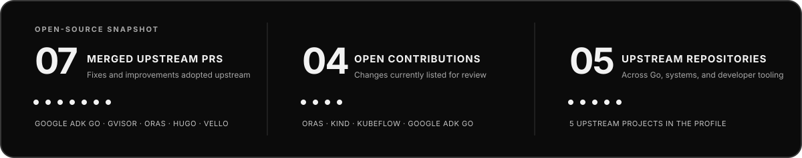

## Overview

I’m Shantanav, a computer science student and engineer interested in what happens behind useful AI products: agent workflows, retrieval and evaluation, backend services, data movement, and the runtime that makes software fast and reliable.

I’ve built multi-service AI products, contributed fixes to established open source projects, and worked on a Rust and WebAssembly rendering pipeline that reduced render latency by 40%. I’m deliberately going deeper into core machine learning, operating-system internals, networking, and performance engineering.

<table>
  <tr>
    <td align="center" width="25%"><strong>40%</strong> lower render latency</td>
    <td align="center" width="25%"><strong>7</strong> merged upstream PRs</td>
    <td align="center" width="25%"><strong>4</strong> open contributions</td>
    <td align="center" width="25%"><strong>3</strong> hackathon podium results</td>
  </tr>
</table>

### What I like building

| Area | The work I’m drawn to |
|---|---|
| AI systems | Agent orchestration, retrieval pipelines, asynchronous inference, and evaluation |
| Backend and infrastructure | Services, queues, databases, event flows, deployment, and observability |
| Systems and performance | Rust, WebAssembly, GPU execution, Linux, and understanding costs below the API |
| Product engineering | Turning an idea into a usable tool with a clear interface and dependable behavior |

## Awards

<table>
  <tr>
    <th align="left">Result</th>
    <th align="left">Event</th>
    <th align="left">Project or track</th>
  </tr>
  <tr>
    <td><strong>1st place</strong></td>
    <td>ETH Mumbai 2026</td>
    <td>BitGo DeFi · VCR Protocol</td>
  </tr>
  <tr>
    <td><strong>2nd place</strong></td>
    <td>ETH Mumbai 2026</td>
    <td>Base AIx Onchain · VCR Protocol</td>
  </tr>
  <tr>
    <td><strong>2nd place</strong></td>
    <td>Solana Blitz V7</td>
    <td>Among 300+ international teams</td>
  </tr>
</table>

The two ETH Mumbai results were earned with Team OmShantyOm for VCR Protocol.

## Open source

I enjoy working in established codebases where a small, well-tested change can improve behavior for many downstream users. The snapshot below reflects the PRs listed here; statuses were checked on 26 September 2026.

<strong>Merged upstream · 7 pull requests</strong>

### Google ADK Go

- [#1257](https://github.com/google/adk-go/pull/1257) Retain usage metadata when later streaming chunks omit it.
- [#1258](https://github.com/google/adk-go/pull/1258) Propagate external cancellation through workflow execution.
- [#1259](https://github.com/google/adk-go/pull/1259) Respect the configured isolation scope for remote agents.

### Other repositories

- [gVisor #14083](https://github.com/google/gvisor/pull/14083) Include a generated changelog in the Debian <code>runsc</code> package.
- [ORAS #2184](https://github.com/oras-project/oras/pull/2184) Publish stable rolling tags for container releases.
- [Hugo #15148](https://github.com/gohugoio/hugo/pull/15148) Resolve the <code>staticcheck</code> executable after <code>go install</code>.
- [Vello #1807](https://github.com/linebender/vello/pull/1807) Document public Cargo features.

<strong>Open contributions · 4 pull requests</strong>

- [ORAS #2191](https://github.com/oras-project/oras/pull/2191) Add multi-platform selection to <code>oras cp</code>, including referrer preservation for the selected platform.
- [kind #4268](https://github.com/kubernetes-sigs/kind/pull/4268) Add a local Markdown lint target and changed-file CI workflow.
- [Kubeflow Testing #1087](https://github.com/kubeflow/testing/pull/1087) Add a reusable Kind-cluster GitHub Action for test workflows.
- [Google ADK Go #1256](https://github.com/google/adk-go/pull/1256) Recover stale database sessions, with a two-writer regression test.

<a href="https://github.com/pulls?q=is%3Apr+author%3ASoundcreates">Browse all my public pull requests</a>

## Toolbox

  &nbsp;&nbsp;
  &nbsp;&nbsp;
  &nbsp;&nbsp;
  &nbsp;&nbsp;
  &nbsp;&nbsp;
  &nbsp;&nbsp;
  &nbsp;&nbsp;
  &nbsp;&nbsp;
  

| Area | Tools and concepts |
|---|---|
| Languages | Python, Go, Rust, TypeScript, JavaScript, C, C++, Dart, Solidity |
| AI and retrieval | LangGraph, RAG, embeddings, vector search, agent workflows, evaluation |
| Backend | FastAPI, NestJS, Node.js, asynchronous workers, REST, gRPC |
| Data | PostgreSQL, Redis, MongoDB, Qdrant, Chroma |
| Systems and infrastructure | Linux, Rust and WebAssembly, WGSL and WebGPU, Docker, Kubernetes, GitHub Actions |
| Product surfaces | React, Flutter, TypeScript |

## Contact

I’m happy to talk about AI systems, backend and infrastructure work, or a concrete open source issue.

  <a href="https://shantanav.in">Portfolio</a> ·
  <a href="https://linkedin.com/in/shantanav-mukherjee/">LinkedIn</a> ·
  <a href="https://github.com/Soundcreates">GitHub</a> ·
  <a href="https://leetcode.com/u/ShantanavM">LeetCode</a> ·
  <a href="mailto:shantanav7@gmail.com">Email</a>

